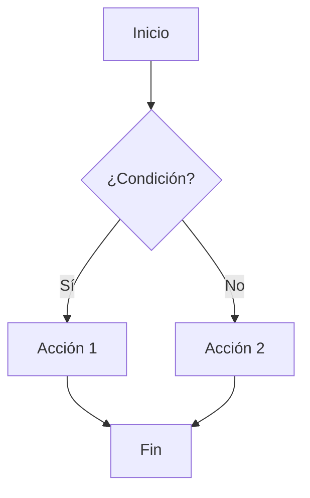
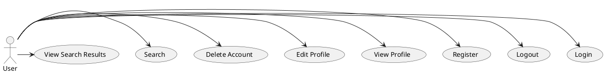

# Ejemplos de plugins

## Ejemplo de plugin de resaltado de código

```javascript linenums="1"
// Ejemplo de plugin de resaltado de código
function highlightCode(code) {
    // Resaltar el código
    return `<pre><code>${code}</code></pre>`;
}
// Ejemplo de uso
const code = "console.log('Hola, mundo!');";
const highlightedCode = highlightCode(code);
console.log(highlightedCode);
```

## Ejemplo de plugin de resaltado de código

```python linenums="1"
# Ejemplo de plugin de resaltado de código
def highlight_code(code):
    # Resaltar el código
    return f"<pre><code>{code}</code></pre>"
# Ejemplo de uso
code = "print('Hola, mundo!')"
highlighted_code = highlight_code(code)
print(highlighted_code)
```

## Ejemplo de gráfico con mermaid



## Ejemplo de gráfico con planUML



## Ejemplo de consejos y advertencias

!!! tip "Consejo"
    Recuerda siempre comentar tus funciones para mejorar la legibilidad.

!!! warning "Advertencia"
    Revisa bien los índices para evitar errores de navegación.
