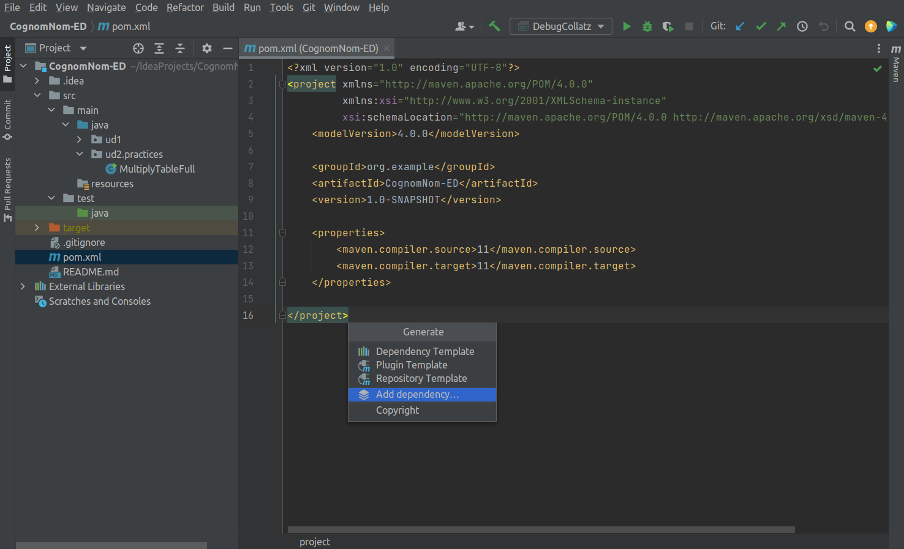

# JUnit

JUnit es una librería de Java que proporciona un marco para escribir y ejecutar pruebas de software.

## Instalación de JUnit mediante Maven

Podemos instalar la librería JUnit mediante Maven.

Maven es una herramienta de gestión de proyectos que se basa en un conjunto de convenciones que definen cómo deben construirse y empaquetarse los proyectos, así como sus dependencias con otros proyectos o librerías.

Esto hace que sea mucho más sencillo gestionar proyectos grandes, ya que se puede utilizar Maven para crear fácilmente una estructura de directorios común y automatizar tareas como la compilación, validación y empaquetado.

Para poder utilizar JUnit en nuestro proyecto, debemos añadir la librería como una dependencia:

1. Abre el archivo pom.xml que se encuentra en la raíz de tu proyecto.
2. Una vez abierto, pulsa Alt + Insert y selecciona Add dependency.
3. En el buscador, escribe junit-jupiter y selecciona la versión más reciente.
4. Asegúrate de que se haya añadido la siguiente entrada al bloque <dependencies>:
5. Para actualizar las dependencias, haz clic derecho en el proyecto y selecciona Maven > Update project o bien haz clic en el icono de actualizar en la barra de herramientas de Maven.

```xml
<dependencies>
  <dependency>
    <groupId>org.junit.jupiter</groupId>
    <artifactId>junit-jupiter</artifactId>
    <version>5.10.0</version> <!-- Usa la última versión disponible -->
    <scope>test</scope>
  </dependency>
</dependencies>
```

Después de añadir esta dependencia, Maven descargará automáticamente JUnit y lo incluirá en el classpath del proyecto cuando ejecutes los tests.



## Creación de las pruebas

En un proyecto Maven, las pruebas deben guardarse en la carpeta src/test/java.

Puedes crear los archivos de prueba manualmente o utilizar las herramientas del IDE (como IntelliJ IDEA o Eclipse).

## Ejecución de las pruebas

Las pruebas pueden ejecutarse de la misma forma que se ejecuta el código fuente, utilizando los botones Run o Debug del IDE.

### Assert

En Java, la instrucción assert se utiliza para comprobar que una determinada condición se cumple durante la ejecución de una prueba unitaria.

Si la condición no se cumple, la prueba lanzará una excepción del tipo AssertionError.

En JUnit, existen muchos tipos diferentes de instrucciones assert disponibles para realizar diversas verificaciones durante la ejecución de pruebas unitarias.

### `assertEquals`

La instrucción `assertEquals(expected, actual)` se utiliza para comprobar que dos valores son iguales, donde expected es el valor esperado y actual es el valor obtenido.

Si expected y actual son iguales, la prueba continuará ejecutándose. Si no lo son, la prueba fallará con un AssertionError.

!!! Importante
    Este método utiliza el método equals() de los objetos para determinar si los objetos son iguales o no.

```java
assertEquals(10, 3 + 7), // Integer
assertEquals('b', 'a' + 1), // Char
assertEquals(1.5, 3.0 / 2), // Double
assertEquals(1.5, 3.1 / 2, 0.1), // Double with tolerance (delta)
assertEquals("HELLO", "hello".toUpperCase()) // String
```

En el caso de los tipos `double` y `float`, se puede definir una tolerancia (delta):

```java
assertEquals(1.5, 3.1 / 2, 0.1), // Double with tolerance (delta)
```

### `assertTrue` y `assertFalse`

Las instrucciones assertTrue(expression) y assertFalse(expression) se utilizan para comprobar que una expresión es verdadera o falsa, respectivamente.
Si la condición no se cumple, la prueba fallará.

```java
assertTrue(isPositive(5));
assertFalse(isPositive(-1));
```

### `assertNull` y `assertNotNull`

Las instrucciones assertNull(object) y assertNotNull(object) se utilizan para comprobar que un objeto es nulo o no nulo, respectivamente. Si no tienen el valor esperado, la prueba fallará.

```java
String a = null;
String b = "Joan";
assertNull(a);
assertNotNull(b);
```

### `assertSame` y `assertNotSame`

Las instrucciones assertSame(expected, actual) y assertNotSame(expected, actual) se utilizan para comprobar que dos objetos son el mismo objeto o no son el mismo objeto, respectivamente. Si no tienen el valor esperado, la prueba fallará.

!!! importante
    Este método utiliza el operador == para determinar si los objetos son iguales o no.

```java
String a = "Joan";
String b = "Joan";
String c = new String("Joan");
assertSame(a, b); // true
assertNotSame(a, c); // true
```

### `assertArrayEquals`

La instrucción assertArrayEquals(expected, actual) se utiliza para comprobar que dos arrays son iguales, donde expected es el array esperado y actual es el array obtenido.

!!! importante
    Este método utiliza el método equals() de los objetos para determinar si los arrays son iguales o no.

```java
double[] intExpected = {1, 2, 3};
double[] intActual = {1, 2, 3};
assertArrayEquals(intExpected, intActual),

double[] doubleExpected = {1.0, 2.0, 3.0};
double[] doubleActual = {1.0, 2.0, 3.0};
assertArrayEquals(doubleExpected, doubleActual ),

String[] stringExpected = {"Hello", "World!"};
String[] stringActual = {"Hello", "World!"};
assertArrayEquals(stringExpected, stringActual)
```

### `assertThrows`

La instrucción assertThrows(expectedType, executable) se utiliza para comprobar que una determinada excepción se lanza al ejecutar un bloque de código.

```java
assertThrows(IllegalArgumentException.class, () -> {
    throw new IllegalArgumentException("Invalid argument");
});
```

### `assertAll`

La instrucción assertAll(executable) se utiliza para agrupar varias aserciones y asegurarse de que todas se ejecutan, incluso si alguna falla.

```java
assertAll("group of assertions",
    () -> assertEquals(1, 1),
    () -> assertEquals(2, 2),
    () -> assertEquals(3, 3)
);
```

## Anotaciones

JUnit proporciona varias anotaciones que se pueden utilizar para definir el comportamiento de las pruebas y los métodos de configuración.

### `@Test`

La anotación @Test se utiliza para marcar un método como un caso de prueba. JUnit ejecutará este método como parte de la suite de pruebas.

```java
@Test
public void testAddition() {
    assertEquals(2, 1 + 1);
}
```

### `@DisplayName`

La anotación @DisplayName se utiliza para proporcionar un nombre legible para el caso de prueba. Esto es útil para documentar el propósito de la prueba y hacer que los informes de prueba sean más comprensibles.

```java
@Test
@DisplayName("Test for addition")
public void testAddition() {
    assertEquals(2, 1 + 1);
}
```

### `@BeforeEach` y `@AfterEach`

Las anotaciones @BeforeEach y @AfterEach se utilizan para definir métodos que se ejecutan antes y después de cada caso de prueba, respectivamente. Esto es útil para configurar el entorno de prueba y limpiar los recursos utilizados.

```java
@BeforeEach
public void setUp() {
    // Código de configuración antes de cada prueba
}
@AfterEach
public void tearDown() {
    // Código de limpieza después de cada prueba
}
```

### `@BeforeAll` y `@AfterAll`

Las anotaciones @BeforeAll y @AfterAll se utilizan para definir métodos que se ejecutan una vez antes y después de todas las pruebas en una clase de prueba, respectivamente. Esto es útil para configurar y limpiar recursos compartidos entre todas las pruebas.

```java
@BeforeAll
public static void setUpAll() {
    // Código de configuración antes de todas las pruebas
}
@AfterAll
public static void tearDownAll() {
    // Código de limpieza después de todas las pruebas
}
```

### `@Disabled`

La anotación @Disabled se utiliza para deshabilitar un caso de prueba o una clase de prueba. Esto es útil cuando se desea omitir temporalmente una prueba sin eliminarla del código.

```java
import org.junit.jupiter.api.Disabled;
import org.junit.jupiter.api.Test;

public class MyTestClass {
    @Test
    public void test1() {
        // test code here
    }

    @Disabled("This test is currently not working, we are working on it")
    @Test
    public void test2() {
        // test code here
    }
}
```

### `@Nested`

La anotación @Nested se utiliza para definir clases de prueba anidadas. Esto es útil para organizar las pruebas en grupos lógicos y mejorar la legibilidad del código.

```java
import org.junit.jupiter.api.Nested;
import org.junit.jupiter.api.Test;

public class MyTestClass {
    @Test
    public void test1() {
        // test code here
    }

    @Nested
    public class NestedTestClass {
        @Test
        public void test2() {
            // test code here
        }

        @Test
        public void test3() {
            // test code here
        }
    }
}
```
