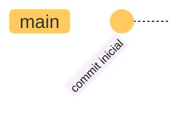

# Introducción a Git: Práctica 1

En esta práctica, aprenderás a crear un nuevo repositorio local, realizar commits y entender la estructura básica de un repositorio Git. Asegúrate de tener Git instalado en tu sistema antes de comenzar.

## Objetivos

- Crear un nuevo repositorio local.
- Realizar commits de archivos.
- Comprender la estructura básica de un repositorio Git.

## Requisitos

- Tener Git instalado en tu sistema.
- Tener acceso a la línea de comandos (terminal).
- Conocimientos básicos de comandos de terminal.
- Conocimientos básicos de Git.

## Pasos a seguir

1. **Crea un nuevo repositorio local**

    ??? summary "Solución"
        Abre la terminal y navega al directorio donde deseas crear el nuevo repositorio. Luego, ejecuta el siguiente comando:

        ```bash
        git init mi_proyecto
        ```

        Reemplaza `mi_proyecto` con el nombre que desees para tu nuevo repositorio. Esto creará un nuevo directorio llamado `.git` en el directorio actual, que contendrá todos los archivos y configuraciones necesarias para el repositorio Git.

2. **Navega al directorio del repositorio**

    ??? summary "Solución"
        Cambia al directorio del nuevo repositorio utilizando el siguiente comando:

        ```bash
        cd mi_proyecto
        ```

3. **Crea un archivo README.md**

    ??? summary "Solución"
        Crea un archivo README.md para documentar tu proyecto. Puedes usar cualquier editor de texto o el siguiente comando:

        ```bash
        echo "# Mi Proyecto" > README.md
        ```

4. **Agrega el archivo al área de preparación**

    ??? summary "Solución"
        Agrega el archivo README.md al área de preparación utilizando el siguiente comando:

        ```bash
        git add README.md
        ```

5. **Realiza un commit con el mensaje "commit inicial"**

    ??? summary "Solución"
        Realiza un commit de los cambios utilizando el siguiente comando:

        ```bash
        git commit -m "commit inicial"
        ```

6. **Visualiza el historial de commits**

    ??? summary "Solución"
        Para ver el historial de commits, utiliza el siguiente comando:

        ```bash
        git log
        ```

        Esto mostrará una lista de todos los commits realizados en el repositorio, junto con sus mensajes y hashes.

## Estructura de nuestro repositorio

Una vez realizado el commit inicial, la estructura de tu repositorio Git local se verá algo así:



## Configura tus credenciales de Git

Para que Git pueda identificarte como autor de los commits, es importante configurar tus credenciales. Puedes hacerlo ejecutando los siguientes comandos en la terminal:

```bash
git config --global user.name "Tu Nombre"
git config --global user.email "tucorreo@ejemplo.com"
```

Esto configurará tu nombre y correo electrónico globalmente para todos los repositorios en tu máquina. Si deseas configurarlos solo para un repositorio específico, omite la opción `--global`.

## Profundizando conceptos

Comprender la estructura interna de un repositorio Git local es fundamental para aprovechar al máximo esta herramienta de control de versiones. Un repositorio Git se encuentra generalmente en un directorio .git en la raíz de tu proyecto. A continuación, se detallan sus componentes principales:​

- **objects/**: Almacena todo el contenido de tus   archivos, commits, árboles y etiquetas. Cada objeto se identifica mediante un hash SHA-1, lo que garantiza la integridad de los datos.​
- **refs/**: Contiene referencias a objetos commit, incluyendo ramas (refs/heads/), etiquetas (refs/tags/) y ramas remotas (refs/remotes/). Estas referencias ayudan a Git a rastrear diversos puntos en la historia de tu proyecto.​
- **HEAD**: Es un archivo que indica la rama o commit actual en el que se basa tu directorio de trabajo. Informa a Git qué utilizar como padre para tu próximo commit.​
- **index**: También conocido como área de preparación o "staging area", este archivo binario contiene una lista ordenada de nombres de ruta, cada uno con permisos y el hash SHA-1 de un objeto blob. Sirve como intermediario entre tu directorio de trabajo y el repositorio, permitiéndote acumular un conjunto de cambios para confirmar juntos.​
- **config**: El archivo de configuración principal de tu proyecto Git, donde se almacenan ajustes como remotos, configuraciones de push y ramas de seguimiento.​
- **logs/**: Registra todos los cambios realizados a las referencias en el repositorio, proporcionando un historial de commits y otras acciones.​


