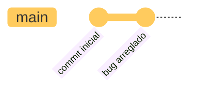

# Introducción a Git: Práctica 3

En esta práctica, aprenderás a clonar un repositorio remoto y realizar cambios en el código.

## Objetivos

- Clonar un repositorio remoto.
- Realizar cambios en el código.
- Hacer un commit de los cambios.
- Hacer un push de los cambios al repositorio remoto.

## Requisitos

- Tener Git instalado en tu sistema.
- Tener una cuenta en GitHub.
- Conocimientos básicos de comandos de terminal.
- Conocimientos básicos de Git.
- Haber completado la Práctica 1: Crear un nuevo repositorio local y realizar un commit inicial.
- Haber completado la Práctica 2: Crear un repositorio remoto en GitHub y hacer un push de tu commit inicial.

## Pasos a seguir

1. **Clona un repositorio remoto**

    ??? summary "Solución"
        - Abre la terminal y navega al directorio donde deseas clonar el repositorio.
        - Usa el siguiente comando para clonar el repositorio remoto:
          ```bash
          git clone <URL del repositorio remoto>
          ```
        - Reemplaza `<URL del repositorio remoto>` con la URL del repositorio que deseas clonar.

2. **Navega al directorio del repositorio clonado**

    ??? summary "Solución"
        - Cambia al directorio del repositorio clonado utilizando el siguiente comando:
          ```bash
          cd nombre_del_repositorio
          ```
        - Reemplaza `nombre_del_repositorio` con el nombre del repositorio clonado.

3. **Realiza cambios en el código**

    ??? summary "Solución"
        - Abre el archivo que deseas modificar en tu editor de texto.
        - Realiza los cambios necesarios y guarda el archivo.

4. **Agrega los cambios al área de preparación**

    ??? summary "Solución"
        - Usa el siguiente comando para agregar los cambios al área de preparación:
          ```bash
          git add nombre_del_archivo
          ```
        - Reemplaza `nombre_del_archivo` con el nombre del archivo que modificaste.
        - Si deseas agregar todos los cambios, puedes usar:
          ```bash
          git add .
          ```
        - Esto agregará todos los archivos modificados al área de preparación.

5. **Realiza un commit con un mensaje "bug arreglado"**

    ??? summary "Solución"
        - Realiza un commit de los cambios utilizando el siguiente comando:
          ```bash
          git commit -m "bug arreglado"
          ```
        - Esto creará un nuevo commit con el mensaje "bug arreglado".

6. **Elimina el vínculo con mi repositorio remoto**

    ??? summary "Solución"
        - Usa el siguiente comando para eliminar el vínculo con el repositorio remoto:
          ```bash
          git remote remove origin
          ```
        - Esto eliminará la referencia al repositorio remoto.

7. **Crea un nuevo repositorio remoto en GitHub y vinculalo con tu repositorio local**

    ??? summary "Solución"
        - Si tienes dudas sobre cómo hacerlo puedes consultar la Práctica 2.

8. **Haz un push de tus cambios al nuevo repositorio remoto**

    ??? summary "Solución"
        - Usa el siguiente comando para hacer un push de tus cambios al nuevo repositorio remoto:
          ```bash
          git push -u origin main
          ```
        - Esto enviará tus cambios al nuevo repositorio remoto y establecerá la rama `main` como la rama de seguimiento.

9. **Verifica que los cambios se han subido correctamente al repositorio remoto**

    ??? summary "Solución"
        - Ve a tu nuevo repositorio en GitHub y verifica que tus cambios se han subido correctamente.
        - Deberías ver el commit con el mensaje "bug arreglado" en la pestaña "Commits" del repositorio.

## Estructura de nuestro repositorio

Una vez realizado el commit inicial, la estructura de tu repositorio Git local se verá algo así:



## Profundizando conceptos

¿Cómo es posible que me muestre dos commits si yo solo hice uno?

- Git es un sistema de control de versiones distribuido, lo que significa que cada copia del repositorio es una copia completa del historial de cambios.
- Cuando clonas un repositorio, obtienes una copia completa de todo el historial de commits, incluyendo los commits que ya existen en el repositorio remoto.
- Por lo tanto, al clonar un repositorio, ya tienes acceso a todos los commits que se han realizado en ese repositorio, incluso si no los has creado tú mismo.
- En este caso, el commit "bug arreglado" es el que tú hiciste, mientras que el commit "commit inicial" es el que ya existía en el repositorio remoto antes de que lo clonaras.
- Esto es normal y esperado en Git, ya que cada commit tiene un identificador único (hash) que lo distingue de los demás.
- Por lo tanto, aunque tú solo hayas creado un commit, el historial de commits del repositorio incluye todos los commits que se han realizado en el repositorio, incluyendo los que ya existían antes de que lo clonaras.
- Esto te permite ver el historial completo de cambios y colaborar con otros desarrolladores de manera efectiva.
