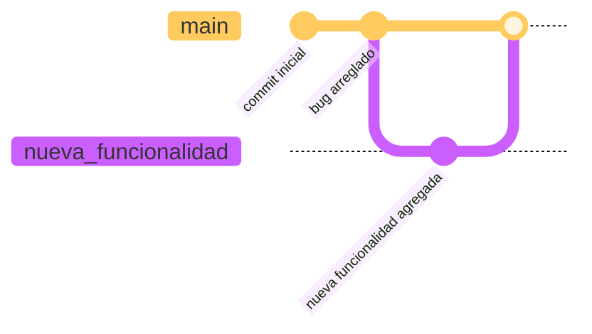

# Introducción a Git: Práctica 4

## Objetivos

- Crear una nueva rama.
- Realizar cambios en el código.
- Hacer un commit de los cambios.
- Hacer un merge con la rama principal.
- Hacer un push de los cambios al repositorio remoto.
- Comprender la importancia de las ramas en Git.

## Requisitos

- Tener Git instalado en tu sistema.
- Tener una cuenta en GitHub.
- Conocimientos básicos de comandos de terminal.
- Conocimientos básicos de Git.
- Haber completado la Práctica 1: Crear un nuevo repositorio local y realizar un commit inicial.
- Haber completado la Práctica 2: Crear un repositorio remoto en GitHub y hacer un push de tu commit inicial.
- Haber completado la Práctica 3: Clonar un repositorio remoto y realizar cambios en el código.

## Pasos a seguir

1. **Crea una nueva rama**

    ??? summary "Solución"
        - Abre la terminal y navega al directorio del repositorio local.
        - Usa el siguiente comando para crear una nueva rama:
          ```bash
          git branch nueva_funcionalidad
          ```

2. **Cambia a la nueva rama**

    ??? summary "Solución"
        - Cambia a la nueva rama utilizando el siguiente comando:
          ```bash
          git checkout nueva_funcionalidad
          ```
        - Alternativamente, puedes crear y cambiar a la nueva rama en un solo paso utilizando:
          ```bash
          git checkout -b nueva_funcionalidad
          ```

3. **Realiza cambios en el código**

    ??? summary "Solución"
        - Abre el archivo que deseas modificar en tu editor de texto.
        - Realiza los cambios necesarios y guarda el archivo.
        - Por ejemplo, puedes agregar una nueva función o corregir un error en el código.

4. **Agrega los cambios al área de preparación**

    ??? summary "Solución"
        - Usa el siguiente comando para agregar los cambios al área de preparación:
          ```bash
          git add nombre_del_archivo
          ```
        - Reemplaza `nombre_del_archivo` con el nombre del archivo que modificaste.
        - Si deseas agregar todos los cambios, puedes usar:
          ```bash
          git add .
          ```
        - Esto agregará todos los archivos modificados al área de preparación.

5. **Realiza un commit con un mensaje "nueva funcionalidad agregada"**

    ??? summary "Solución"
        - Realiza un commit de los cambios utilizando el siguiente comando:
          ```bash
          git commit -m "Nueva funcionalidad agregada"
          ```
        - Esto creará un nuevo commit con el mensaje "Nueva funcionalidad agregada".

6. **Haz un merge con la rama principal**

    ??? summary "Solución"
        - Cambia a la rama principal utilizando el siguiente comando:
          ```bash
          git checkout main
          ```
        - Luego, haz un merge de la nueva rama con la rama principal:
          ```bash
          git merge nueva_funcionalidad
          ```
        - Esto combinará los cambios de la nueva rama en la rama principal.

7. **Haz un push de los cambios al repositorio remoto**

    ??? summary "Solución"
        - Usa el siguiente comando para hacer un push de los cambios al repositorio remoto:
          ```bash
          git push origin main
          ```
        - Esto actualizará el repositorio remoto con los cambios realizados en la rama principal.

8. **Verifica que los cambios se hayan reflejado en el repositorio remoto**

    ??? summary "Solución"
        - Abre tu navegador y ve a la página de tu repositorio en GitHub.
        - Verifica que los cambios realizados en la rama principal se hayan reflejado en el repositorio remoto.

9. **Elimina la rama creada**

    ??? summary "Solución"
        - Si ya no necesitas la rama creada, puedes eliminarla utilizando el siguiente comando:
          ```bash
          git branch -d nueva_funcionalidad
          ```
        - Esto eliminará la rama `nueva_funcionalidad` de tu repositorio local.

10. **Visualiza el historial de commits en modo gráfico**

    ??? summary "Solución"
        - Usa el siguiente comando para visualizar el historial de commits en modo gráfico:
          ```bash
          git log --oneline --graph
          ```
        - Esto mostrará un gráfico del historial de commits, incluyendo las ramas y merges realizados.
        - Puedes usar `q` para salir del modo gráfico.

## Estructura de nuestro repositorio

Una vez realizado el commit inicial, la estructura de tu repositorio Git local se verá algo así:



## Profundizando conceptos

**¿Qué es el puntero HEAD?**

El puntero HEAD es una referencia especial en Git que indica la rama o commit en el que te encuentras actualmente. Cuando cambias de rama, el puntero HEAD se actualiza para apuntar a la nueva rama. Esto te permite trabajar en diferentes ramas y realizar cambios sin afectar la rama principal hasta que decidas hacer un merge.

**¿Cuantas ramas puedo crear?**

No hay un límite específico en la cantidad de ramas que puedes crear en un repositorio Git. Puedes crear tantas ramas como necesites para organizar tu trabajo y gestionar diferentes características o correcciones de errores. Sin embargo, es recomendable mantener un número razonable de ramas para evitar confusiones y facilitar la gestión del repositorio.


