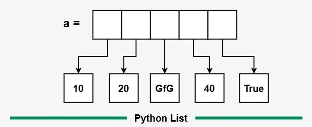

# UT3: Tipos de datos complejos

## Introducción

Bienvenid@s a la Unidad de Trabajo 3 (UT3) del módulo profesional optativo (MPO) de Python. En esta unidad, nos centraremos en los tipos de datos complejos, que son fundamentales para el desarrollo de programas en Python. Aprenderás a utilizar listas, diccionarios y tuplas para almacenar y manipular datos de manera eficiente.

## Tipos de datos complejos

Los tipos de datos complejos son estructuras que permiten almacenar múltiples valores en una sola variable. En Python, los tipos de datos complejos más comunes son las listas, los diccionarios y las tuplas. Cada uno de estos tipos tiene sus propias características y usos.

### Listas

Las listas son colecciones ordenadas y mutables de elementos. Puedes almacenar diferentes tipos de datos en una lista, incluyendo números, cadenas y otros objetos. Las listas se definen utilizando corchetes `[]` y los elementos se separan por comas.

```python
mi_lista = [1, 2, 3, "Hola", True]
```

Si te fijas en el ejemplo anterior, `mi_lista` contiene cinco elementos: tres números enteros (1, 2, 3), una cadena de texto ("Hola") y un valor booleano (True). Las listas pueden contener elementos de diferentes tipos, lo que las hace muy versátiles.

Antes de entrar en las operaciones que se pueden realizar con listas, es importante entender cómo se almacenan los elementos en ellas. Cada elemento de una lista tiene un índice asociado, que comienza en 0. Por ejemplo, en la lista `mi_lista` anterior, el primer elemento (1) tiene un índice de 0, el segundo elemento (2) tiene un índice de 1, y así sucesivamente.



Internamente, Python almacena las listas como una secuencia de referencias a los objetos que contienen. Esto significa que cuando creas una lista, Python no copia los objetos en la lista, sino que almacena referencias a ellos. Esto es importante tenerlo en cuenta, ya que puede afectar el rendimiento y el comportamiento de tu programa.

Puedes acceder a los elementos de una lista utilizando su índice. Por ejemplo, para acceder al primer elemento de `mi_lista`, puedes usar:

```python
print(mi_lista[0])  # Imprime: 1
```

También puedes acceder a los elementos desde el final de la lista utilizando índices negativos. Por ejemplo, `mi_lista[-1]` te dará el último elemento de la lista.

```python
print(mi_lista[-1])  # Imprime: True
```

Para declarar una lista vacía, puedes usar:

```python
mi_lista_vacia = []
```

O también puedes usar la función `list()`:

```python
mi_lista_vacia = list()
```

### Operaciones con listas

Las listas permiten realizar operaciones como agregar, eliminar y modificar elementos. Algunas de las operaciones más comunes son:

- `append()`: Agrega un elemento al final de la lista.
- `insert()`: Inserta un elemento en una posición específica de la lista.
- `remove()`: Elimina el primer elemento con el valor especificado.
- `pop()`: Elimina y devuelve el último elemento de la lista (o el elemento en la posición especificada).
- `sort()`: Ordena los elementos de la lista en orden ascendente.
- `reverse()`: Invierte el orden de los elementos en la lista.
- `len()`: Devuelve la longitud de la lista (número de elementos).

### Otras características de las listas

Las listas también tienen otras características interesantes, como la posibilidad de anidar listas dentro de otras listas (listas multidimensionales) y la capacidad de utilizar comprensiones de listas para crear nuevas listas de manera concisa.

Este tipo de estructuras las denominamos listas anidadas. Por ejemplo:

```python
mi_lista_anidada = [[1, 2, 3], ["Hola", "Mundo"], [True, False]]
```

En este caso, `mi_lista_anidada` contiene tres listas, cada una con diferentes tipos de datos. Puedes acceder a los elementos de las listas anidadas utilizando múltiples índices:

```python
print(mi_lista_anidada[0][1])  # Imprime: 2
print(mi_lista_anidada[1][0])  # Imprime: Hola
```

<<<<<<< HEAD
## [Ejercicios de clase: listas](ejercicios_listas_clase.md)

Para practicar lo aprendido en esta unidad, hemos preparado una serie de ejercicios que te ayudarán a consolidar tus conocimientos. Puedes encontrar los ejercicios en el siguiente enlace
=======
## Diccionarios

Un **diccionario** es una estructura de datos en Python que almacena pares **clave-valor**. Cada clave es única y se utiliza para acceder a su valor asociado.

```python
persona = {
    "nombre": "Ana",
    "edad": 30,
    "ciudad": "Valencia"
}
```

### Características principales

- Las **claves** deben ser de tipo **inmutable** (strings, números, tuplas...).
- Los **valores** pueden ser de cualquier tipo.
- Los elementos no están ordenados (hasta Python 3.6 era completamente desordenado; desde Python 3.7 mantiene el orden de inserción).
- Se pueden anidar diccionarios dentro de otros diccionarios.

### Operaciones básicas

#### Crear un diccionario

Para crear un diccionario, puedes usar llaves `{}` o la función `dict()`:

```python
mi_dic = {}  # Diccionario vacío
mi_dic = dict(nombre="Luis", edad=25)
```

### Acceder a valores

El acceso a los valores se realiza mediante la clave, es parecido a acceder a un elemento de una lista, pero en lugar de usar un índice, usas una clave:

```python
print(persona["nombre"])  # Ana
```

Ten en cuenta que se lanza un error si la clave no existe.

Es recomendable usar el método `.get()` para evitar errores:

```python
print(persona.get("apellido", "No especificado"))
```

En este caso, si la clave "apellido" no existe, se devuelve "No especificado" en lugar de lanzar un error.

### Modificar valores

Para modificar un valor en un diccionario, simplemente asignas un nuevo valor a la clave correspondiente:

```python
persona["edad"] = 31
```

### Añadir nuevos pares clave-valor

De manera similar, puedes añadir nuevos pares clave-valor, la sintaxis es la misma que para modificar, pero la diferencia es que si la clave no existe, se crea un nuevo par:

```python
persona["profesión"] = "Ingeniera"
```

### Eliminar elementos

Para eliminar un elemento de un diccionario, puedes usar el método `pop()` o la palabra clave `del`:

```python
del persona["ciudad"]
persona.pop("edad")
```

### Comprobar si una clave existe

Para comprobar si una clave existe en un diccionario, puedes usar el operador `in`:

```python
if "nombre" in persona:
    print("La clave existe")
```

### Recorrer un diccionario

Para recorrer un diccionario, puedes usar un bucle `for`. Puedes iterar sobre las claves, los valores o ambos:

- Recorrer claves:
  
```python
for clave in persona:
    print(clave)
```

- Recorrer valores:

```python
for valor in persona.values():
    print(valor)
```

- Recorrer claves y valores:

```python
for clave, valor in persona.items():
    print(f"{clave}: {valor}")
```

## Métodos útiles

| Método         | Descripción                                             |
| -------------- | ------------------------------------------------------- |
| `get(clave)`   | Devuelve el valor asociado a la clave                   |
| `keys()`       | Devuelve una vista con las claves                       |
| `values()`     | Devuelve una vista con los valores                      |
| `items()`      | Devuelve pares (clave, valor)                           |
| `pop(clave)`   | Elimina la clave y devuelve su valor                    |
| `update(dic2)` | Actualiza con los pares clave-valor de otro diccionario |

## Diccionarios anidados

```python
alumnos = {
    "alumno1": {"nombre": "Juan", "nota": 7},
    "alumno2": {"nombre": "Laura", "nota": 9}
}
```

## Ejemplo práctico

```python
inventario = {
    "manzanas": 10,
    "naranjas": 5,
    "plátanos": 7
}

for fruta, cantidad in inventario.items():
    print(f"Tengo {cantidad} {fruta}")
```

## Tuplas

Una **tupla** es una colección ordenada e **inmutable** de elementos. Una vez creada, **no se puede modificar** (ni añadir, ni eliminar, ni cambiar elementos).

```python
mi_tupla = (1, 2, 3)
```

### Características principales

- Las tuplas son **inmutables**.
- Pueden contener elementos de **diferentes tipos**.
- Permiten elementos duplicados.
- Son **más eficientes** en memoria que las listas.
- Se pueden **desempaquetar** fácilmente.

### Crear tuplas

Una tupla se define utilizando paréntesis `()`. Puedes crear una tupla con uno o más elementos, y si es una tupla unitaria, debes incluir una coma al final para diferenciarla de un simple valor entre paréntesis.

```python
tupla1 = (1, 2, 3)
tupla_unitaria = (5,)       # Necesita la coma
tupla_vacia = tuple()
```

> ⚠️ Sin la coma, `(5)` es solo un entero con paréntesis.

### Acceder a elementos

Una tupla se comporta de manera similar a una lista en cuanto al acceso a sus elementos. Puedes acceder a los elementos utilizando índices, que comienzan en 0.

```python
print(tupla1[0])      # Primer elemento
print(tupla1[-1])     # Último elemento
```

### Recorrer una tupla

Así como con las listas, puedes recorrer los elementos de una tupla utilizando un bucle `for`:

- Recorriendo sus elementos, con un for each.
- Recorriendo sus índices, con un for range.

```python
for elemento in tupla1:
    print(elemento)
```

### Operaciones comunes

| Operación          | Ejemplo           |
| ------------------ | ----------------- |
| Longitud           | `len(tupla1)`     |
| Concatenar         | `tupla1 + tupla2` |
| Repetir            | `tupla1 * 2`      |
| Ver si contiene    | `2 in tupla1`     |
| Índice de elemento | `tupla1.index('hola')` |
| Contar elementos   | `tupla1.count('adios')` |

### Desempaquetado

Desempaquetar una tupla significa asignar sus elementos a variables individuales. Esto es útil cuando conoces la estructura de la tupla y quieres trabajar con sus valores de manera más directa.

```python
persona = ("Ana", 30, "Valencia")
nombre, edad, ciudad = persona

print(nombre)  # Ana
```

> ⚠️ El número de variables debe coincidir con los elementos de la tupla.

### Tuplas anidadas

Las tuplas también pueden contener otras tuplas, lo que permite crear estructuras de datos más complejas. Esto es útil para representar datos relacionados de manera estructurada.

```python
notas = (
    ("Juan", 7),
    ("Lucía", 8),
    ("Pedro", 6)
)

for nombre, nota in notas:
    print(f"{nombre} sacó un {nota}")
```

### ¿Tupla o lista?

| Aspecto     | Tupla                    | Lista             |
| ----------- | ------------------------ | ----------------- |
| Mutabilidad | Inmutable                | Mutable           |
| Rendimiento | Más rápida y ligera      | Más pesada        |
| Uso común   | Datos fijos o constantes | Datos que cambian |
| Sintaxis    | Paréntesis `()`          | Corchetes `[]`    |

### Ejemplo práctico

```python
coordenada = (39.4699, -0.3763)

def mostrar_ubicacion(coord):
    lat, lon = coord
    print(f"Latitud: {lat}, Longitud: {lon}")

mostrar_ubicacion(coordenada)
```

## [Ejercicios de clase: listas](ejercicios_listas_clase.md)

## [Ejercicios de clase: diccionarios y tuplas](ejercicios_diccionarios_clase.md)

Para practicar lo aprendido en esta unidad, hemos preparado una serie de ejercicios que te ayudarán a consolidar tus conocimientos. Puedes encontrar los ejercicios en el siguiente enlace:
>>>>>>> 01ba69e (ut3)

## [Ejercicios extra UT3](ejercicios_ut3_extra.md)
