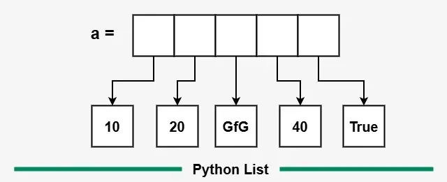

# UT3: Tipos de datos complejos

## Introducción

Bienvenid@s a la Unidad de Trabajo 3 (UT3) del módulo profesional optativo (MPO) de Python. En esta unidad, nos centraremos en los tipos de datos complejos, que son fundamentales para el desarrollo de programas en Python. Aprenderás a utilizar listas, diccionarios y tuplas para almacenar y manipular datos de manera eficiente.

## Tipos de datos complejos

Los tipos de datos complejos son estructuras que permiten almacenar múltiples valores en una sola variable. En Python, los tipos de datos complejos más comunes son las listas, los diccionarios y las tuplas. Cada uno de estos tipos tiene sus propias características y usos.

### Listas

Las listas son colecciones ordenadas y mutables de elementos. Puedes almacenar diferentes tipos de datos en una lista, incluyendo números, cadenas y otros objetos. Las listas se definen utilizando corchetes `[]` y los elementos se separan por comas.

```python
mi_lista = [1, 2, 3, "Hola", True]
```

Si te fijas en el ejemplo anterior, `mi_lista` contiene cinco elementos: tres números enteros (1, 2, 3), una cadena de texto ("Hola") y un valor booleano (True). Las listas pueden contener elementos de diferentes tipos, lo que las hace muy versátiles.

Antes de entrar en las operaciones que se pueden realizar con listas, es importante entender cómo se almacenan los elementos en ellas. Cada elemento de una lista tiene un índice asociado, que comienza en 0. Por ejemplo, en la lista `mi_lista` anterior, el primer elemento (1) tiene un índice de 0, el segundo elemento (2) tiene un índice de 1, y así sucesivamente.



Internamente, Python almacena las listas como una secuencia de referencias a los objetos que contienen. Esto significa que cuando creas una lista, Python no copia los objetos en la lista, sino que almacena referencias a ellos. Esto es importante tenerlo en cuenta, ya que puede afectar el rendimiento y el comportamiento de tu programa.

Puedes acceder a los elementos de una lista utilizando su índice. Por ejemplo, para acceder al primer elemento de `mi_lista`, puedes usar:

```python
print(mi_lista[0])  # Imprime: 1
```

También puedes acceder a los elementos desde el final de la lista utilizando índices negativos. Por ejemplo, `mi_lista[-1]` te dará el último elemento de la lista.

```python hl_lines="1"
print(mi_lista[-1])  # Imprime: True
```

Para declarar una lista vacía, puedes usar:

```python
mi_lista_vacia = []
```

O también puedes usar la función `list()`:

```python
mi_lista_vacia = list()
```

### Operaciones con listas

Las listas permiten realizar operaciones como agregar, eliminar y modificar elementos. Algunas de las operaciones más comunes son:

- `append()`: Agrega un elemento al final de la lista.
- `insert()`: Inserta un elemento en una posición específica de la lista.
- `remove()`: Elimina el primer elemento con el valor especificado.
- `pop()`: Elimina y devuelve el último elemento de la lista (o el elemento en la posición especificada).
- `sort()`: Ordena los elementos de la lista en orden ascendente.
- `reverse()`: Invierte el orden de los elementos en la lista.
- `len()`: Devuelve la longitud de la lista (número de elementos).

### Otras características de las listas

Las listas también tienen otras características interesantes, como la posibilidad de anidar listas dentro de otras listas (listas multidimensionales) y la capacidad de utilizar comprensiones de listas para crear nuevas listas de manera concisa.

Este tipo de estructuras las denominamos listas anidadas. Por ejemplo:

```python
mi_lista_anidada = [[1, 2, 3], ["Hola", "Mundo"], [True, False]]
```

En este caso, `mi_lista_anidada` contiene tres listas, cada una con diferentes tipos de datos. Puedes acceder a los elementos de las listas anidadas utilizando múltiples índices:

```python hl_lines="1 2"
print(mi_lista_anidada[0][1])  # Imprime: 2
print(mi_lista_anidada[1][0])  # Imprime: Hola
```

### Listas multidimensionales

Una **lista multidimensional** es una lista que contiene otras listas en su interior. En la práctica, se utilizan mucho para representar datos organizados en filas y columnas, como una tabla, una matriz o un tablero.

Para definir una lista de dos dimensiones, escribimos una lista principal y, dentro de ella, varias listas internas. Cada lista interna suele representar una fila:

```python
matriz = [
    [1, 2, 3],
    [4, 5, 6],
    [7, 8, 9]
]
```

También podemos inicializar una lista de dos dimensiones con un valor inicial. Por ejemplo, la siguiente matriz tiene 3 filas y 4 columnas, y todos sus valores empiezan en 0:

```python hl_lines="4"
filas = 3
columnas = 4

matriz = [[0 for columna in range(columnas)] for fila in range(filas)]

print(matriz)
```

La salida sería:

```python
[[0, 0, 0, 0], [0, 0, 0, 0], [0, 0, 0, 0]]
```

> ⚠️ Aunque pueda parecer más sencillo, evita crear matrices así:
>
> ```python
> matriz = [[0] * columnas] * filas
> ```
>
> En este caso, Python reutiliza la misma lista interna varias veces. Si modificas una fila, se modificarán también las demás.

Por ejemplo, podemos representar las notas de varios alumnos en distintas asignaturas:

```python
notas = [
    [7, 8, 6],
    [5, 9, 7],
    [10, 8, 9]
]
```

En este caso, `notas` contiene tres listas. Cada lista interior representa las notas de un alumno. Podemos imaginarlo de esta forma:

| Alumno | Asignatura 1 | Asignatura 2 | Asignatura 3 |
| ------ | ------------ | ------------ | ------------ |
| 0      | 7            | 8            | 6            |
| 1      | 5            | 9            | 7            |
| 2      | 10           | 8            | 9            |

Para acceder a un elemento concreto usamos dos índices:

- El primer índice indica la **fila**.
- El segundo índice indica la **columna**.

```python hl_lines="1 2"
print(notas[0][1])  # Imprime: 8
print(notas[2][0])  # Imprime: 10
```

En el primer ejemplo, `notas[0][1]` accede a la fila 0 y a la columna 1. Como los índices empiezan en 0, el resultado es la segunda nota del primer alumno.

También podemos modificar un valor de una lista multidimensional:

```python hl_lines="1"
notas[1][0] = 6

print(notas)
```

Después de esta modificación, la primera nota del segundo alumno pasa de 5 a 6.

Para recorrer una lista multidimensional, podemos utilizar bucles `for` anidados:

```python hl_lines="1 2"
for fila in notas:
    for nota in fila:
        print(nota)
```

Si además queremos mostrar la posición de cada elemento, podemos recorrer la lista usando índices:

```python hl_lines="1 2"
for i in range(len(notas)):
    for j in range(len(notas[i])):
        print(f"Alumno {i}, asignatura {j}: {notas[i][j]}")
```

Las listas multidimensionales pueden tener más de dos niveles, aunque lo más habitual al empezar es trabajar con listas de dos dimensiones, parecidas a tablas.

## Diccionarios

Un **diccionario** es una estructura de datos en Python que almacena pares **clave-valor**. Cada clave es única y se utiliza para acceder a su valor asociado.

```python
persona = {
    "nombre": "Ana",
    "edad": 30,
    "ciudad": "Valencia"
}
```

### Características principales

- Las **claves** deben ser de tipo **inmutable** (strings, números, tuplas...).
- Los **valores** pueden ser de cualquier tipo.
- Los elementos no están ordenados (hasta Python 3.6 era completamente desordenado; desde Python 3.7 mantiene el orden de inserción).
- Se pueden anidar diccionarios dentro de otros diccionarios.

### Operaciones básicas

#### Crear un diccionario

Para crear un diccionario, puedes usar llaves `{}` o la función `dict()`:

```python
mi_dic = {}  # Diccionario vacío
mi_dic = dict(nombre="Luis", edad=25)
```

### Acceder a valores

El acceso a los valores se realiza mediante la clave, es parecido a acceder a un elemento de una lista, pero en lugar de usar un índice, usas una clave:

```python
print(persona["nombre"])  # Ana
```

Ten en cuenta que se lanza un error si la clave no existe.

Es recomendable usar el método `.get()` para evitar errores:

```python hl_lines="1"
print(persona.get("apellido", "No especificado"))
```

En este caso, si la clave "apellido" no existe, se devuelve "No especificado" en lugar de lanzar un error.

### Modificar valores

Para modificar un valor en un diccionario, simplemente asignas un nuevo valor a la clave correspondiente:

```python
persona["edad"] = 31
```

### Añadir nuevos pares clave-valor

De manera similar, puedes añadir nuevos pares clave-valor, la sintaxis es la misma que para modificar, pero la diferencia es que si la clave no existe, se crea un nuevo par:

```python
persona["profesión"] = "Ingeniera"
```

### Eliminar elementos

Para eliminar un elemento de un diccionario, puedes usar el método `pop()` o la palabra clave `del`:

```python
del persona["ciudad"]
persona.pop("edad")
```

### Comprobar si una clave existe

Para comprobar si una clave existe en un diccionario, puedes usar el operador `in`:

```python
if "nombre" in persona:
    print("La clave existe")
```

### Recorrer un diccionario

Para recorrer un diccionario, puedes usar un bucle `for`. Puedes iterar sobre las claves, los valores o ambos:

- Recorrer claves:
  
```python
for clave in persona:
    print(clave)
```

- Recorrer valores:

```python
for valor in persona.values():
    print(valor)
```

- Recorrer claves y valores:

```python hl_lines="1"
for clave, valor in persona.items():
    print(f"{clave}: {valor}")
```

## Métodos útiles

| Método         | Descripción                                             |
| -------------- | ------------------------------------------------------- |
| `get(clave)`   | Devuelve el valor asociado a la clave                   |
| `keys()`       | Devuelve una vista con las claves                       |
| `values()`     | Devuelve una vista con los valores                      |
| `items()`      | Devuelve pares (clave, valor)                           |
| `pop(clave)`   | Elimina la clave y devuelve su valor                    |
| `update(dic2)` | Actualiza con los pares clave-valor de otro diccionario |

## Diccionarios anidados

```python
alumnos = {
    "alumno1": {"nombre": "Juan", "nota": 7},
    "alumno2": {"nombre": "Laura", "nota": 9}
}
```

## Ejemplo práctico

```python
inventario = {
    "manzanas": 10,
    "naranjas": 5,
    "plátanos": 7
}

for fruta, cantidad in inventario.items():
    print(f"Tengo {cantidad} {fruta}")
```

## Tuplas

Una **tupla** es una colección ordenada e **inmutable** de elementos. Una vez creada, **no se puede modificar** (ni añadir, ni eliminar, ni cambiar elementos).

```python
mi_tupla = (1, 2, 3)
```

### Características principales

- Las tuplas son **inmutables**.
- Pueden contener elementos de **diferentes tipos**.
- Permiten elementos duplicados.
- Son **más eficientes** en memoria que las listas.
- Se pueden **desempaquetar** fácilmente.

### Crear tuplas

Una tupla se define utilizando paréntesis `()`. Puedes crear una tupla con uno o más elementos, y si es una tupla unitaria, debes incluir una coma al final para diferenciarla de un simple valor entre paréntesis.

```python hl_lines="2"
tupla1 = (1, 2, 3)
tupla_unitaria = (5,)       # Necesita la coma
tupla_vacia = tuple()
```

> ⚠️ Sin la coma, `(5)` es solo un entero con paréntesis.

### Acceder a elementos

Una tupla se comporta de manera similar a una lista en cuanto al acceso a sus elementos. Puedes acceder a los elementos utilizando índices, que comienzan en 0.

```python
print(tupla1[0])      # Primer elemento
print(tupla1[-1])     # Último elemento
```

### Recorrer una tupla

Así como con las listas, puedes recorrer los elementos de una tupla utilizando un bucle `for`:

- Recorriendo sus elementos, con un for each.
- Recorriendo sus índices, con un for range.

```python
for elemento in tupla1:
    print(elemento)
```

### Operaciones comunes

| Operación          | Ejemplo           |
| ------------------ | ----------------- |
| Longitud           | `len(tupla1)`     |
| Concatenar         | `tupla1 + tupla2` |
| Repetir            | `tupla1 * 2`      |
| Ver si contiene    | `2 in tupla1`     |
| Índice de elemento | `tupla1.index('hola')` |
| Contar elementos   | `tupla1.count('adios')` |

### Desempaquetado

Desempaquetar una tupla significa asignar sus elementos a variables individuales. Esto es útil cuando conoces la estructura de la tupla y quieres trabajar con sus valores de manera más directa.

```python hl_lines="2"
persona = ("Ana", 30, "Valencia")
nombre, edad, ciudad = persona

print(nombre)  # Ana
```

> ⚠️ El número de variables debe coincidir con los elementos de la tupla.

### Tuplas anidadas

Las tuplas también pueden contener otras tuplas, lo que permite crear estructuras de datos más complejas. Esto es útil para representar datos relacionados de manera estructurada.

```python
notas = (
    ("Juan", 7),
    ("Lucía", 8),
    ("Pedro", 6)
)

for nombre, nota in notas:
    print(f"{nombre} sacó un {nota}")
```

### ¿Tupla o lista?

| Aspecto     | Tupla                    | Lista             |
| ----------- | ------------------------ | ----------------- |
| Mutabilidad | Inmutable                | Mutable           |
| Rendimiento | Más rápida y ligera      | Más pesada        |
| Uso común   | Datos fijos o constantes | Datos que cambian |
| Sintaxis    | Paréntesis `()`          | Corchetes `[]`    |

### Ejemplo práctico

```python hl_lines="4"
coordenada = (39.4699, -0.3763)

def mostrar_ubicacion(coord):
    lat, lon = coord
    print(f"Latitud: {lat}, Longitud: {lon}")

mostrar_ubicacion(coordenada)
```

## Sets

Un **set** o **conjunto** es una colección **no ordenada** de elementos **únicos**. Esto significa que no mantiene una posición fija para cada elemento y que no permite elementos duplicados.

```python
mi_set = {1, 2, 3, 4}
```

Los sets son muy útiles cuando necesitas eliminar valores repetidos o comprobar rápidamente si un elemento pertenece a una colección.

### Características principales

- Los sets son **mutables**: se pueden añadir y eliminar elementos.
- No permiten elementos duplicados.
- No tienen un orden fijo.
- No se puede acceder a sus elementos mediante índices.
- Solo pueden contener elementos **inmutables** (números, cadenas, tuplas...).

### Crear sets

Un set se define utilizando llaves `{}`. También puedes crear un set a partir de otra colección utilizando la función `set()`.

```python
numeros = {1, 2, 3, 4}
colores = set(["rojo", "verde", "azul"])
set_vacio = set()
```

> ⚠️ Para crear un set vacío debes usar `set()`. Si escribes `{}`, Python crea un diccionario vacío.

Si creas un set con elementos repetidos, Python elimina automáticamente los duplicados:

```python
numeros = {1, 2, 2, 3, 3, 3}

print(numeros)  # Imprime: {1, 2, 3}
```

### Añadir y eliminar elementos

Para añadir elementos a un set puedes usar el método `add()`. Para eliminar elementos, puedes usar `remove()` o `discard()`.

```python
frutas = {"manzana", "pera", "naranja"}

frutas.add("plátano")
frutas.remove("pera")

print(frutas)
```

La diferencia entre `remove()` y `discard()` es importante:

- `remove()` elimina un elemento, pero lanza un error si no existe.
- `discard()` elimina un elemento si existe, pero no lanza error si no está en el set.

```python
frutas.discard("kiwi")
```

### Comprobar si un elemento existe

Para comprobar si un elemento pertenece a un set, usamos el operador `in`:

```python
if "manzana" in frutas:
    print("La fruta está en el set")
```

### Recorrer un set

Puedes recorrer los elementos de un set con un bucle `for`, igual que con listas, diccionarios o tuplas. Como los sets no tienen orden fijo, no debes depender del orden en el que aparecen sus elementos.

```python
for fruta in frutas:
    print(fruta)
```

### Operaciones comunes

| Operación          | Ejemplo                 | Descripción                                  |
| ------------------ | ----------------------- | -------------------------------------------- |
| Longitud           | `len(frutas)`           | Devuelve el número de elementos              |
| Añadir elemento    | `frutas.add("uva")`     | Añade un elemento al set                     |
| Eliminar elemento  | `frutas.remove("uva")`  | Elimina un elemento y da error si no existe  |
| Eliminar sin error | `frutas.discard("uva")` | Elimina un elemento si existe                |
| Vaciar set         | `frutas.clear()`        | Elimina todos los elementos                  |
| Ver si contiene    | `"uva" in frutas`       | Comprueba si un elemento está en el set      |

### Operaciones entre sets

Los sets permiten realizar operaciones matemáticas de conjuntos, como unión, intersección y diferencia.

```python
grupo_a = {"Ana", "Luis", "Marta"}
grupo_b = {"Marta", "Pedro", "Ana"}
```

| Operación             | Ejemplo             | Resultado esperado                              |
| --------------------- | ------------------- | ----------------------------------------------- |
| Unión                 | `grupo_a | grupo_b` | Todos los elementos sin repetir                 |
| Intersección          | `grupo_a & grupo_b` | Elementos que están en ambos                    |
| Diferencia            | `grupo_a - grupo_b` | Elementos de `grupo_a` que no están en `grupo_b` |
| Diferencia simétrica | `grupo_a ^ grupo_b` | Elementos que están solo en uno de los dos sets |

```python
print(grupo_a | grupo_b)  # Unión
print(grupo_a & grupo_b)  # Intersección
print(grupo_a - grupo_b)  # Diferencia
```

### Ejemplo práctico

Un uso muy común de los sets es eliminar elementos repetidos de una lista:

```python hl_lines="2"
nombres = ["Ana", "Luis", "Ana", "Marta", "Luis"]
nombres_sin_repetir = set(nombres)

print(nombres_sin_repetir)
```

En este caso, `nombres_sin_repetir` contendrá cada nombre una sola vez.

## [Ejercicios de clase: listas](ejercicios_listas_clase.md)

## [Ejercicios de clase: diccionarios y tuplas](ejercicios_diccionarios_clase.md)

Para practicar lo aprendido en esta unidad, hemos preparado una serie de ejercicios que te ayudarán a consolidar tus conocimientos. Puedes encontrar los ejercicios en el siguiente enlace:

## [Ejercicios extra UT3](ejercicios_ut3_extra.md)
